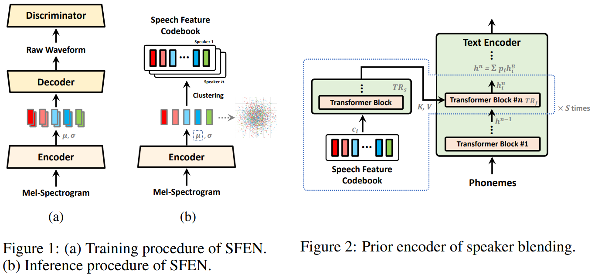
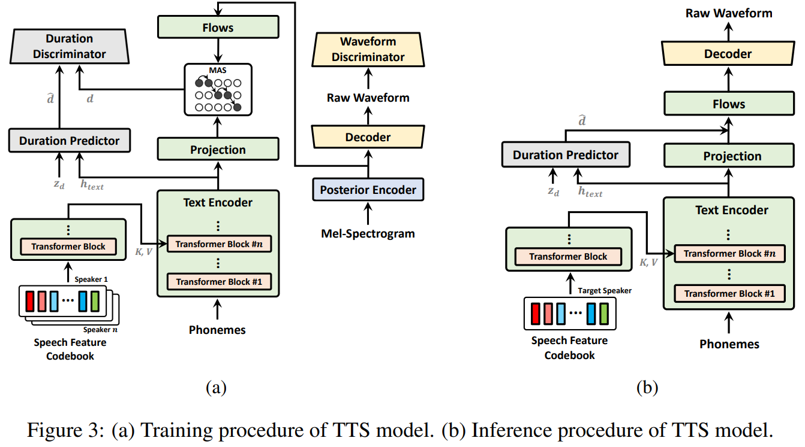
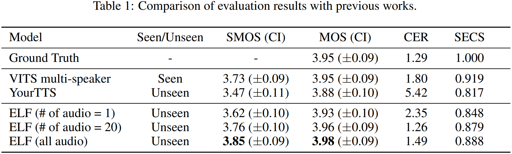

# Encoding Speaker-specific Latent Speech Feature for Speech Synthesis
<blockquote style="border-left: 2px solid; padding-left: 10px; margin-left: 0;">
Jungil Kong, Junmo Lee, Jeongmin Kim, Beomjeong Kim, Jihoon Park, Dohee Kong, Changheon Lee, Sangjin Kim  
arXiv, 2023  
[<a href="https://arxiv.org/pdf/2311.11745.pdf">Paper</a>] [<a href="https://speechelf.github.io/elf-demo/">Demo</a>] 
</blockquote>

## Goal
새로운 화자의 전반적인 특징으로 주어진 content에 맞는 음성 합성

## Motivations
기존의 TTS 모델은 reference 음성으로부터 화자의 특징을 표현하는 벡터를 추출해서 사용한다.
그러나 이 방법은 화자의 전반적인 특징을 표현하는 것에 대해 근본적인 한계점을 갖는다.
- 이러한 한계점으로 인한 부자연스러운 음성 합성 예시
  - referece speech: "I'm so happy!"  
  - text: "I'm so sad."

## Method
### 1. Overview
화자들은 이러한 문제점들을 해결하기 위해 Encoding speaker-specific latent speech features (ELF)를 제시한다.

[//]: # (- Encoding various speech features from speakers' speech into a dense and continuous distribution)

[//]: # (- Clustering these speech features to  obtain discretized representative points)

[//]: # (- Design a module to fuse the discretized speech feature into a hidden representation of the content trough attention)

[//]: # (  - 이것은 speech feature space를 학습할 뿐만 아니라 주어진 content를 자연스럽게 표현하도록 features들이 융합되도록 한다.)
  
학습과정에서 화자의 전반적인 특징을 조건으로 주기 위하여 ELF는 two-stage로 구성됐다.
첫번째 stage는 각각의 speech features를 encoding하고 
두번째 stage는 encoded features를 conditioning 함으로써 화자의 음성특성을 표현하는 음성을 합성한다.

### 2. Speech feature encoding

VAE 기반의 speech feature encoding network (SFEN)을 제안한다.
기본적인 구조와 학습방법은 Flow가 빠진 VITS와 동일하다고 생각하면 된다.
학습을 위한 ELBO 식은 

$$ 
\log p_{\theta}(x) \geq \mathbb{E}_{q_{\phi}(z|x)}[\log p_{\theta}(x|z)] - D_{KL}(q_{\phi}(z|x)||p(z)) 
$$

달라진 점은 attention을 통해 화자 정보를 blending 해준다는 것이다.
이때 화자 컨디션인 speech feature codebook을 만드는 방법을 설명하자면 다음과 같다.

    i. Autoencoder의 encoder로 모든 오디오의 $\mu$를 얻는다. (frame level)
    ii. 화자별로 $\mu$를 k-mean++로 clustering 해준다.
    iii. clusters의 centroids를 화자의 latent speech feature codebook으로 쓴다.

### 3. Text-to-speech with speech feature condition

TTS 모델은 VITS를 기반으로 했고 몇가지 변동점이 있다.  
첫번째는, 저자들은 텍스트에 나와있지 않은 스피커만의 발음과 억양같은 특성을 살리기 위해 text encoder의 중간 feature들과 융합하여 사용했다.
다만 이때, 음성 특성은 불연속적으로 나눌 수 없기 때문에 cluster된 벡터들을 개별적으로 샘플링하여 feature로 사용하는것은 합리적이지 않다.
대신에 저자들은 이 feature들을 모델 중간 feature (15th) 에 softmax attention score와 함께 결합하고 더해줌으로써, 
continuous space 상의 음성 feature point를 샘플링 하는 것과 유사한 효과를 내도록 했다.

두번째는 duration discriminator를 추가했고 세번째는 long-term dependencies를 더 잘잡기 위해 flow에 작은 transformer를 추가했다.

## Results

Speaker blending과 speech feature-to-speech 실험도 있지만 TTS결과만 소개하겠다. 
speech feature codebook을 만드는데에 사용한 speech 샘플 수에 따른 비교를 했다.
샘플이 1개일 때는 clustering 하지 않고 $\mu$를 바로 사용했다.
화자 유사도 측면에서 더 많은 샘플을 쓸수록 좋아지는 것을 확인 했다.

## 참고
### ELBO 식전개
$$
\begin{align}
\log p_{\theta}(x) &= \int q_{\phi}(z|x) \log \frac{p_{\theta}(x,z)}{p_{\theta}(z|x)}dz \\
  &= \int q_{\phi}(z|x) 
\end{align}
$$
